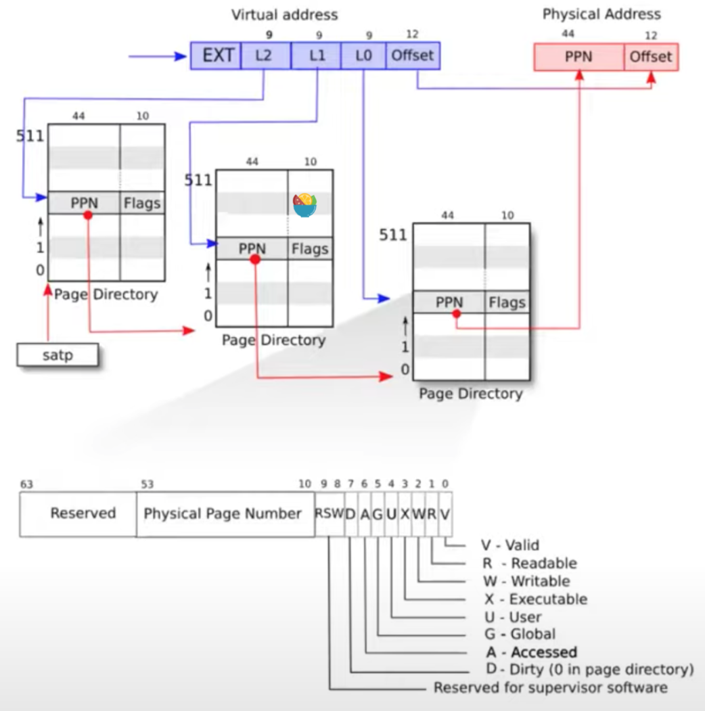

# Lab: page tables

In this lab you will explore page tables and modify them to simplify the functions that copy data from user space to kernel space.

## 知识点
这节课的难度比较大，[课程参考资料这里](https://mit-public-courses-cn-translatio.gitbook.io/mit6-s081/lec04-page-tables-frans/4.1-ke-cheng-nei-rong-jian-jie)

###  一些概念
 虚拟内存(Virtual Memory)                       ---- VM
 地址管理单元(Memory Management Unit)           ---- MMU
 物理页号(Physical Page Number)                 ---- PPN
 Directory中的一个条目被称为(Page Table Entry)   ---- PTE
 页表缓存(Translation Lookside Buffer)          ---- TLB

### 页表（page table）

对于任何一条带有地址的指令，其中的地址应该认为是虚拟内存地址而不是物理地址。假设寄存器a0中是地址0x1000，那么这是一个虚拟内存地址。虚拟内存地址会被转到内存管理单元（MMU，Memory Management Unit），再由 MMU 将虚拟地址翻译成物理地址，物理地址会被用来索引物理内存，所以一但 MMU 打开，所有的指令都变成了虚拟地址

RISC-V上一个叫做 **SATP** 的寄存器（在 CPU 中）会保存表单（虚拟地址到物理地址的映射表）在物理内存中的地址。

每个程序都有自己的表单，进程切换的时候要切换 **SATP** 的寄存器内的地址。

page table是一个多级（三级）的结构


一个directory是4096Bytes，**和页的大小一样**。Directory 的一个条目被称为PTE 64bits，就像寄存器的大小一样，也就是8Bytes。所以一个Directory page有512个条目。

正因为任意一级的一个页表大小和一个页一样，所以找到下一级的页表只需要 PPN，而不需要 offset。这样就可以一级级向下找页表了，而且也节省了页表所占的空间（有这页才需要页表）。

页表缓存（TLB），处理器实现，操作系统不可知，清空TLB的指令是sfence_vma

三级的页表是硬件实现的，但是 xv6 中的 `walk` 函数实现了同意的功能

### 实现

`main` 中函数 `kinit()` 初始化内核的物理页, 会把 `0x8000 0000` 后的第一个 `% PAGSIZE == 0` 的作为页的开始, `PHYSTOP` 为结束, 分页, 清空(全部填 1)`kfree`,然后用链表串起来

接下来是 `kvminithart()` ,初始化了内核的页表，其中有很多将物理地址映射到页表的操作，也会为每个进程预先设置号一个内核栈数组，并且完成物理映射。

最后是 `kvminithart()`，先清空了 TLB，然后把 SATP 寄存器设置为根表。


## Speed up system calls (easy)


## Print a page table (easy)

任务：输出第一个进程的页表

1. 在 `kernel/exec.c` 内的 `exec` 内添加判断与输出
```c
int
exec(char *path, char **argv)
{
  // ...
  if(p->pid==1) {
    vmprint(p->pagetable);
  }
  // return argc;
}
```
1. 在 `kernel/defs.h` 内添加函数申明 `void vmprint(pagetable_t);`
2. 在 `kernel/vm.c` 内仿照 `freewalk` 写实现函数
```c
void
_kmprint(pagetable_t pagetable, int level) {
  for(int i = 0; i < 512; i++){
    pte_t pte = pagetable[i];
    // page is valid
    if(pte & PTE_V){
      for(int j = 0; j < level; j ++) {
        if(j) printf(" ");
        printf("..");
      }
      uint64 child = PTE2PA(pte);
      printf("%d: pte %p pa %p\n", i, pte, child);
      // PTE to Lower-lever page table
      if((pte & (PTE_R|PTE_W|PTE_X)) == 0)
        _kmprint((pagetable_t)child, level + 1);
    } else if(pte & PTE_V){
      panic("_kmprint: leaf");
    }
  }
}

void
vmprint(pagetable_t pagetable) {
  printf("page table %p\n", pagetable);
  _kmprint(pagetable, 1);
}
```

运行
```sh
page table 0x0000000087f6c000
..0: pte 0x0000000021fda001 pa 0x0000000087f68000
.. ..0: pte 0x0000000021fd9c01 pa 0x0000000087f67000
.. .. ..0: pte 0x0000000021fda41b pa 0x0000000087f69000
.. .. ..1: pte 0x0000000021fd9817 pa 0x0000000087f66000
.. .. ..2: pte 0x0000000021fd9407 pa 0x0000000087f65000
.. .. ..3: pte 0x0000000021fd9017 pa 0x0000000087f64000
..255: pte 0x0000000021fdac01 pa 0x0000000087f6b000
.. ..511: pte 0x0000000021fda801 pa 0x0000000087f6a000
.. .. ..510: pte 0x0000000021fdd007 pa 0x0000000087f74000
.. .. ..511: pte 0x0000000020001c0b pa 0x0000000080007000
init: starting sh
```

测试 **没通过**，我电脑的执行结果如上，与答案有区别，可能是 xv6 初始化写法改变但题目未更新？

## A kernel page table per process (hard)

任务：原本得内核页表是共享得，这次得任务是让每个进程拥有自己得内核页表

1. 在 `kernel/proc.h` 的 `struct proc` 添加一项 `pagetable_t kernelpgtbl;     // kernel page table`
2. 仿写 `kernel/vm.c` 中的 `kvmmake` 函数, 创建新函数 `pagetable_t kvminit_kpgtbl(void)` 来实现为每个进程初始化内核页表，并且映射设备的物理地址
```c
// Initialize the process kernel_pagetable
pagetable_t
kvminit_kpgtbl(void)
{
  pagetable_t kpgtbl;

  kpgtbl = (pagetable_t) kalloc();
  memset(kpgtbl, 0, PGSIZE);

  // uart registers
  kvmmap(kpgtbl, UART0, UART0, PGSIZE, PTE_R | PTE_W);

  // virtio mmio disk interface
  kvmmap(kpgtbl, VIRTIO0, VIRTIO0, PGSIZE, PTE_R | PTE_W);

  // PLIC
  kvmmap(kpgtbl, PLIC, PLIC, 0x400000, PTE_R | PTE_W);

  // map kernel text executable and read-only.
  kvmmap(kpgtbl, KERNBASE, KERNBASE, (uint64)etext-KERNBASE, PTE_R | PTE_X);

  // map kernel data and the physical RAM we'll make use of.
  kvmmap(kpgtbl, (uint64)etext, (uint64)etext, PHYSTOP-(uint64)etext, PTE_R | PTE_W);

  // map the trampoline for trap entry/exit to
  // the highest virtual address in the kernel.
  kvmmap(kpgtbl, TRAMPOLINE, (uint64)trampoline, PGSIZE, PTE_R | PTE_X);

  return kpgtbl;
}
```
3. 注释调进程分配内核栈的代码，因为现在是每一个进程都有自己的内核栈，所以不需要原来的那种内核栈分配了
```c
static struct proc*
allocproc(void)
{
  // ...
  // alloc kernel page table
  p->kernelpgtbl = kvminit_kpgtbl();
  if(p->kernelpgtbl == 0){
    freeproc(p);
    release(&p->lock);
    return 0;
  }

  // 分配一个物理页，作为新进程的内核栈使用
  char *pa = kalloc();
  if(pa == 0)
    panic("kalloc");
   // 将内核栈映射到固定的逻辑地址上
  uint64 va = KSTACK((int)(p - proc));
  kvmmap(p->kernelpgtbl, va, (uint64)pa, PGSIZE, PTE_R | PTE_W);
  p->kstack = va;

  // ...
}
```
4. 修改 `scheduler` 函数，每次进程切换的时候也要切换内核页表
```c
void
scheduler(void)
{
  // ...
        // 切换到进程独立的内核页表
        w_satp(MAKE_SATP(p->kernelpgtbl));
        sfence_vma(); // 清除快表缓存

        swtch(&c->context, &p->context);
        // 切换回全局页表
  // ...
}
```
5. 释放内核栈
```c
static void
freeproc(struct proc *p)
{
  // ...
  void *kstack_pa = (void *)kvmpa(p->kernelpgtbl, p->kstack);
  // printf("trace: free kstack %p\n", kstack_pa);
  kfree(kstack_pa);
  p->kstack = 0;
  proc_free_kernelpgtbl(p->kernelpgtbl);
  // ...
}

void
proc_free_kernelpgtbl(pagetable_t pagetable) {
  for(int i = 0; i < 512; i++){
    pte_t pte = pagetable[i];
    uint64 child = PTE2PA(pte);
    if((pte & PTE_V) && (pte & (PTE_R|PTE_W|PTE_X)) == 0){ 
      // 递归释放低一级页表及其页表项
      proc_free_kernelpgtbl((pagetable_t)child);
      pagetable[i] = 0;
    }
  }
  kfree((void*)pagetable); // 释放当前级别页表所占用空间
}
// kernel/vm.c
uint64
kvmpa(pagetable_t pgtbl, uint64 va)
{
  uint64 off = va % PGSIZE;
  pte_t *pte;
  uint64 pa;

  pte = walk(pgtbl, va, 0);
  if(pte == 0)
    panic("kvmpa");
  if((*pte & PTE_V) == 0)
    panic("kvmpa");
  pa = PTE2PA(*pte);
  return pa+off;
}
```

测试：`usertest` 全部 `OK`
```sh
ALL TESTS PASSED
```


## Simplify copyin/copyinstr (hard)

任务：实现将用户空间的映射添加到每个进程的内核页表，将进程的页表复制一份到进程的内核页表

1. 创建从用户页表拷贝到内核页表的函数, 要去除 `PTE_U` 的标签
```c
void
u2kvmcopy(pagetable_t pagetable, pagetable_t kernelpt, uint64 oldsz, uint64 newsz){
  pte_t *pte_from, *pte_to;
  oldsz = PGROUNDUP(oldsz);
  for (uint64 i = oldsz; i < newsz; i += PGSIZE){
    if((pte_from = walk(pagetable, i, 0)) == 0)
      panic("u2kvmcopy: src pte does not exist");
    if((pte_to = walk(kernelpt, i, 1)) == 0)
      panic("u2kvmcopy: pte walk failed");
    uint64 pa = PTE2PA(*pte_from);
    uint flags = (PTE_FLAGS(*pte_from)) & (~PTE_U);
    *pte_to = PA2PTE(pa) | flags;
  }
}
```
2. 给 `exec` `fork` `userinit`加上空间映射的函数
```c
  // 复制到进程的内核页表
  u2kvmcopy(np->pagetable, np->kernelpgtbl, 0, np->sz);
```
3. 修改程序增长函数
```c
int
growproc(int n)
{
  uint64 sz;
  struct proc *p = myproc();

  sz = p->sz;
  if(n > 0){
    //防止用户进程增长到超过PLIC的地址
    if (PGROUNDUP(sz + n) >= PLIC){
      return -1;
    }
    if((sz = uvmalloc(p->pagetable, sz, sz + n, PTE_W)) == 0) {
      return -1;
    }
    // 复制一份到内核页表
    u2kvmcopy(p->pagetable, p->kernelpgtbl, sz - n, sz);
  } else if(n < 0){
    sz = uvmdealloc(p->pagetable, sz, sz + n);
  }
  p->sz = sz;
  return 0;
}
```
