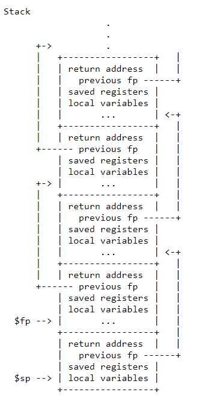

# Lab: traps

This lab explores how system calls are implemented using traps. You will first do a warm-up exercises with stacks and then you will implement an example of user-level trap handling.

## 学习记录

一个 trap 过程 `eg: write()`
1. 用户进程调用 `write`, 在 `usys.pl` 中，有以下内容
```s
write:
    li a7, SYS_write
    ecall
    ret
```
在 `kernel/syscall.h` 中定义了各种系统调用的编号，在调用时会把对应的编号存入 `a7` 寄存器，`ecall` 进入内核空间，`ret` 返回用户空间。

2. 执行 `ecall`, 指令指向 `0x3ffffff000` 也就是 `page table` 输出的最后一个`page —— trampoline page`，至于为什么时这个地址是有 `STVEC` 寄存器决定的，在内核转用户之前确定了 `trap` 运行的第一行代码的位置。

> ecall 作的三件事：
> 1. 切换到 `supervisor mode`
> 2. 程序计数器的值保存在了 `SEPC` 寄存器
> 3. 跳转到 `STVEC` 寄存器指向的指令 

3. `trampoline.S` 中完成了很多切换操作，比如保存寄存器，指向内核栈，切换到内核页表等，trampoline 的地址在内核与用户下完全一致，所以切换页表寄存器不会有问题，最后进入 `usertrap` 函数

4. `usertrap` 函数，从前面在 tp 寄存器内存的 hartid（CPU编号）找到当前进程，trapframe 保存 `SEPC` 寄存器 后面会 +4 从而指向用户空间的下一条指令，`intr_on()`显示的打开终端后调用 `syscall`;

5. `syscall` 指向系统调用，后进入 `usertrapret`，返回用户空间前的工作。`intr_off` 关闭终端，`STVEC` 寄存器指向`trampoline`代码，在那里最终会执行`sret`指令返回到用户空间。位于`trampoline`代码最后的`sret`指令会重新打开中断。从trapframe 中保存一些值，下一次用得到。SSTATUS寄存器，这是一个控制寄存器。这个寄存器的SPP bit位控制了sret指令的行为，该bit为0表示下次执行sret的时候，我们想要返回user mode而不是supervisor mode。这个寄存器的SPIE bit位控制了，在执行完sret之后，是否打开中断。因为我们在返回到用户空间之后，我们的确希望打开中断，所以这里将SPIE bit位设置为1。修改完这些bit位之后，把新的值写回到SSTATUS寄存器。主要做的是一些恢复工作，与进入内核前的工作相反，**把userret汇编代码的地址强转成函数指针，然后调用，就进入 汇编中的 userret了**。

6. `userret` 恢复到用户态，`a0` 存的是系统调用的返回值

## RISC-V assembly (easy)

Q:Which registers contain arguments to functions? For example, which register holds 13 in main's call to printf?
A: `a2`

Q:Where is the call to function f in the assembly code for main? Where is the call to g? (Hint: the compiler may inline functions.)
A: 内联优化了，直接算出了结果

Q:At what address is the function printf located?
A: 0x630

Q:What value is in the register ra just after the jalr to printf in main?
A: 0x38

Q:
> Run the following code.
```c
	unsigned int i = 0x00646c72;
	printf("H%x Wo%s", 57616, &i);
```
> What is the output? 
> The output depends on that fact that the RISC-V is little-endian. If the > RISC-V were instead big-endian what would you set i to in order to yield > the same output? Would you need to change 57616 to a different value?

A: little-endian: HE110 World, if big-endian, i need to be 0x726c6400

Q: In the following code, what is going to be printed after 'y='? (note: the answer is not a specific value.) Why does this happen?
```c
	printf("x=%d y=%d", 3);
```
A: may be the number in register `a2`

## Backtrace (moderate)


1. 在 `kernel/def.h` 中添加申明 `void            backtrace(void);`
2. 在 `kernel/riscv.h` 中添加获取 `fp` 寄存器的方法，fp 指向当前栈帧的开始地址，sp 指向当前栈帧的结束地址
```c
// read register fp(frame pointer)
static inline uint64
r_fp()
{
  uint64 x;
  asm volatile("mv %0, s0" : "=r" (x));
  return x;
}
```
3. 编写函数，[文档链接](https://pdos.csail.mit.edu/6.1810/2022/lec/l-riscv.txt)**栈帧中从高到低第一个 8 字节 fp-8 是 return address，也就是当前调用层应该返回到的地址。栈帧中从高到低第二个 8 字节 fp-16 是 previous address，指向上一层栈帧的 fp 开始地址。**


```c
void backtrace()
{
  printf("backtrace:\n");
  // 获取 fp
  uint64 fp = r_fp();
  // 如果没有达栈底
  while(fp != PGROUNDUP(fp)) { 
    uint64 ra = *(uint64*)(fp - 8); // return address
    printf("%p\n", ra);
    fp = *(uint64*)(fp - 16); // previous fp
  }
}
```
4. 修改 `sys_sleep` 函数, 也可以考虑在 `panic` 函数内加入这个调用
```c
uint64
sys_sleep(void)
{
  int n;
  uint ticks0;
  // 调用 backtrace（）
  backtrace();
}
```

运行
```sh
$ bttest
backtrace:
0x0000000080002130
0x0000000080002022
0x0000000080001d18
$ 
// terminal window
❯ addr2line -e kernel/kernel 0x0000000080002130
/home/sy/MIT-6.1810/xv6-labs-2022/kernel/sysproc.c:59
```

## Alarm (hard)

任务：实现一个系统调用，`sigalarm(interval, handler)`

1. 在 `user/user.h` 中添加系统调用声明 `int sigalarm(int ticks, void (*handler)()); int sigreturn(void);` 
2. 在 `user/usys.pl` 中加入 `entry("sigalarm"); entry("sigreturn");`  
3. 在 `kernel/syscall.h` 中加入 `#define SYS_sigalarm 22`, 
4. 在 `kernel/syscall.c` 中加入 
```c
extern uint64 sys_sigalarm(void);
extern uint64 sys_sigreturn(void);

static uint64 (*syscalls[])(void) = {
[SYS_sigalarm] sys_sigalarm,
[SYS_sigreturn] sys_sigreturn,
}
```
5. 在 `kernel/proc.h` 中添加与 alarm 有关的项
```c
struct proc{
  // alarm!!!
  int alarm_interval;          // 报警间隔时间
  void (*alarm_handler)();     // 报警处理函数
  int ticks_count;             // 两次报警间的滴答计数
  int is_alarming;                    // 是否正在执行告警处理函数
  struct trapframe* alarm_trapframe;  // 告警陷阱帧
}
```
6. 两个系统调用的实现(其实可以合二为一)
```c
// kernel/sysproc.c
uint64 sys_sigalarm(void) {
  int n;
  uint64 fn;
  argint(0, &n);
  argaddr(1, &fn);
  if( n < 0 || fn < 0)
    return -1;
  return sigalarm(n, (void(*)())(fn));
}

uint64 sys_sigreturn(void) {
	return sigreturn();
}
// kernel/def.h      trap.c
int             sigalarm(int, void(*)());
int             sigreturn(void);
// kernel/trap.c
int sigalarm(int ticks, void(*handler)()) {
  // 设置 myproc 中的相关属性
  struct proc *p = myproc();
  p->alarm_interval = ticks;
  p->alarm_handler = handler;
  p->ticks_count = ticks;
  return 0;
}
int sigreturn() {
  // 将 trapframe 恢复到时钟中断之前的状态，恢复原本正在执行的程序流
  struct proc *p = myproc();
  *p->trapframe = *p->alarm_trapframe;
  p->is_alarming = 0;
  return 0;
}
```
7. `allocproc  freeproc` 中实现初始化与释放 alarm 的项
```c
static struct proc*
allocproc(void)
{
  // ...
  // alarm 相关
  if((p->alarm_trapframe = (struct trapframe *)kalloc()) == 0){
    freeproc(p);
    release(&p->lock);
    return 0;
  }

  p->alarm_interval = 0;
  p->alarm_handler = 0;
  p->ticks_count = 0;
  p->is_alarming = 0;
  // ...
}

static void
freeproc(struct proc *p)
{
  // ...
  // alarm
  if(p->alarm_trapframe)
    kfree((void*)p->alarm_trapframe);
  p->alarm_trapframe = 0;
  p->is_alarming = 0;
  p->alarm_interval = 0;
  p->alarm_handler = 0;
  p->ticks_count = 0;
}
```

8. 修改 `usertrap`
```c
void
usertrap(void)
{
  ...
  // give up the CPU if this is a timer interrupt.
  if(which_dev == 2) {
  // printf("begin -> a0: %d\n", p->trapframe->a0);
    // alarm
    if(p->alarm_interval > 0 && --p->ticks_count <= 0 && p->is_alarming == 0) {
      // p->ticks_count = p->alarm_interval;
      // printf("p->alarm_interval = %d", p->alarm_interval);
      // 保存寄存器内容
      memmove(p->alarm_trapframe, p->trapframe, sizeof(struct trapframe));
      // 要在保存寄存器内容后再设置epc
      p->trapframe->epc = (uint64)p->alarm_handler;
      p->is_alarming = 1;
    }
    yield();
  // printf("end -> a0: %d\n", p->trapframe->a0);
  }
  usertrapret();
}
```
9. `Makefile` 中加入 `alarmtest.c` 也就是加一行 `$U/_alarmtest\`

测试
```c
hart 2 starting
hart 1 starting
init: starting sh
$ alarmtest
test0 start
...........alarm!
test0 passed
test1 start
..alarm!
..alarm!
alarm!
.alarm!
.alarm!
alarm!
.alarm!
..alarm!
alarm!
..alarm!
.test1 passed
test2 start
...........alarm!
test2 passed
test3 start
test3 failed: register a0 changed
$ 
```

第三个测试点失败了，a0 在一些地方被修改了，下次再找下原因